# ToDo Application

## Описание
Это приложение направлено на сохранение задач, которые вам предстоит выполнить, и которые вы уже выполнили. Приложение имеет 4 страницы:
- Страницу с завершенными задачами;
- Страницу с не завершенными задачами;
- Страницу с курсами валют;
- Страницу с картой.

## Переключение между страницами
Для переключения между страницами существует меню, которое можно вызвать с помощью кнопки слева сверху. В нем присутствуют кнопки для переключения на соответствующую страницу.
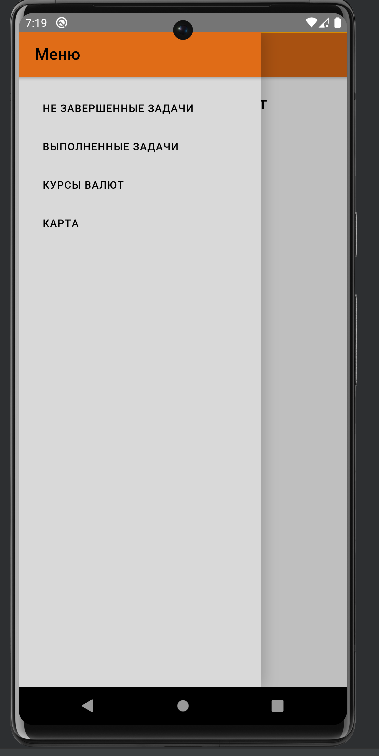

## Страница с не завершенными задачами

На данной странице присутствует список с не завершенными задачами и кнопка для создания задач.

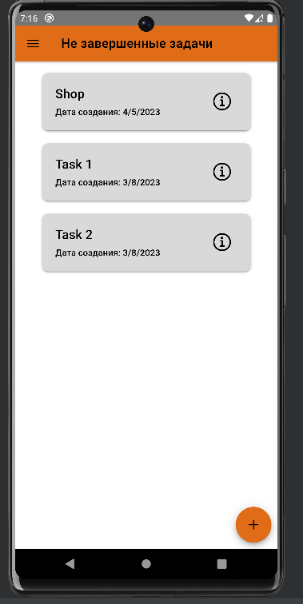

При нажатии на кнопку для создания задачи перед выми всплывет модальное окно для ввода данных.
В соответствующие поля вводим соответствующие значения.

По умолчанию статус задачи - "Не завершено".

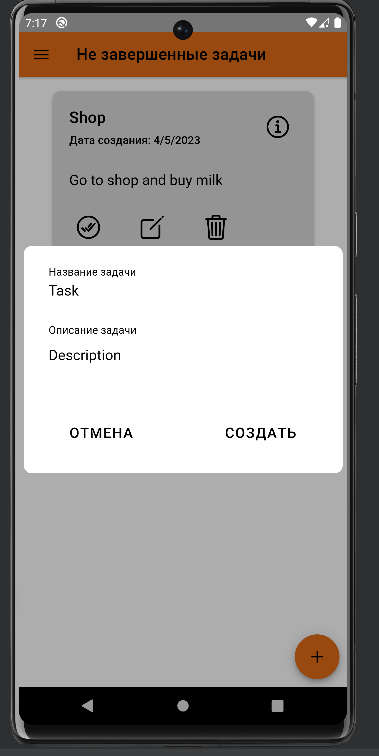

После ввода данных нажимаем кнопку "Создать", чтобы создать задачу или "Отмена" для отмены сохранения.

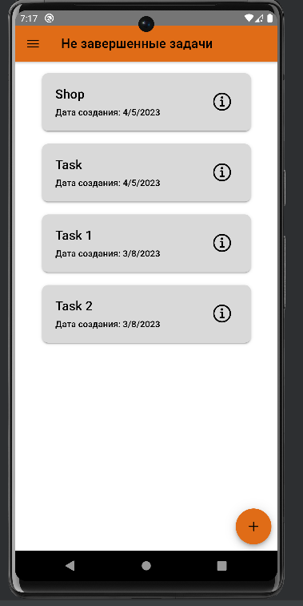

Каждый элемент списка можно раскрыть, нажав на кнопку i справа у элемента, и будут видны дополнительные кнопки:
- Присвоение статуса "Завершено"
- Редактирование задачи
- Удаление задачи

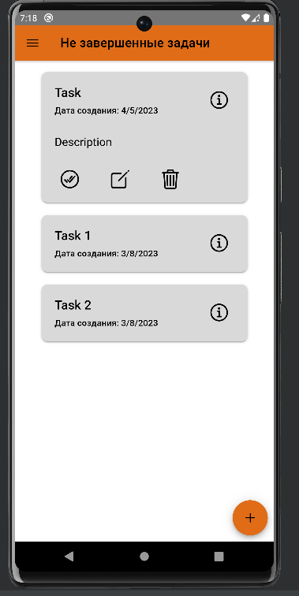

При нажатии на кнопку для присвоения статуса - задача переносится на другую страницу, а именно страницу с завершенными задачами.

При нажатии на кнопку для редактирования задачи перед выми всплывет модальное окно для изменения данных.
Меняем нужные вам данные.

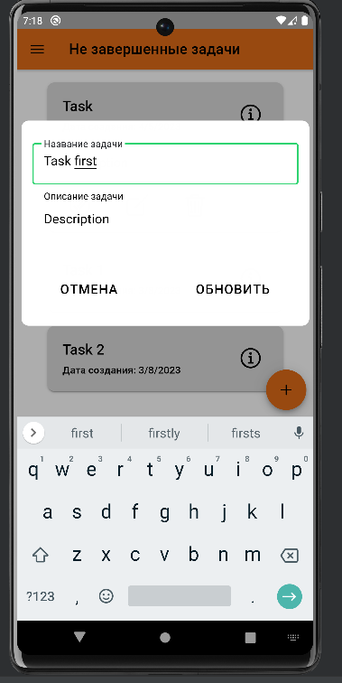

После изменения данных нажимаем кнопку "Обновить", чтобы обновить тело задачи или "Отмена" для отмены сохранения.

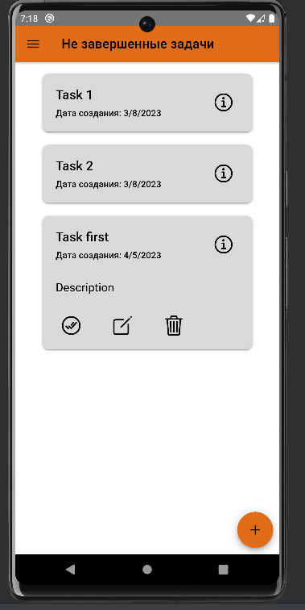

При нажатии на кнопку для удаления - задача удаляется.

При обновлении страницы, свайпом вниз, список задач обновится

## Страница с завершенными задачами

На данной странице присутствует список с завершенными задачами.

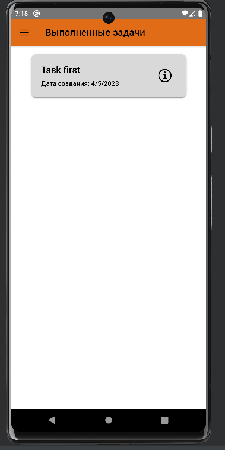

Каждый элемент списка можно раскрыть, нажав на кнопку i справа у элемента, и будут видны дополнительные кнопки:
- Присвоение статуса "Не завершено"
- Редактирование задачи
- Удаление задачи

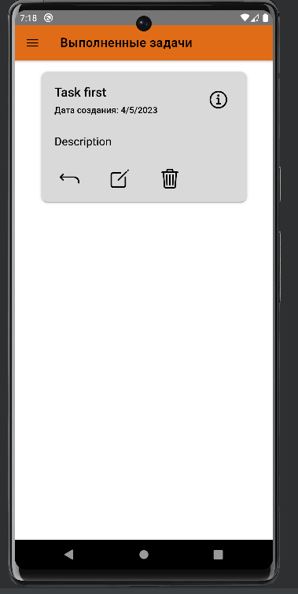

При нажатии на кнопку для присвоения статуса - задача переносится на другую страницу, а именно страницу с не завершенными задачами.

При нажатии на кнопку для редактирования задачи перед выми всплывет модальное окно для изменения данных.
Меняем нужные вам данные.

После изменения данных нажимаем кнопку "Обновить", чтобы обновить тело задачи или "Отмена" для отмены сохранения.

При нажатии на кнопку для удаления - задача удаляется.

При обновлении страницы, свайпом вниз, список задач обновится

## Страницу с курсами валют

На данной странице присутствует список со следующими курсами валют:
- Bitcoin;
- Ethereum;
- Dogecoin;
- Monero;
- USD;
- EUR.

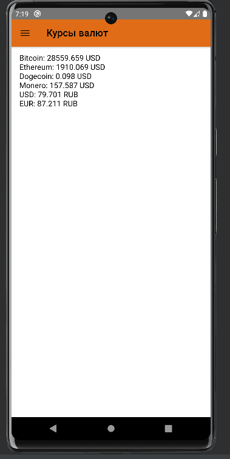

При обновлении страницы, свайпом вниз, значения криптовалют обновятся

## Страницу с картой

На данной странице находится карта с меткой на наш институт.

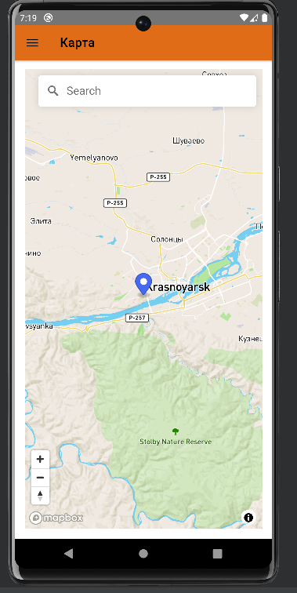